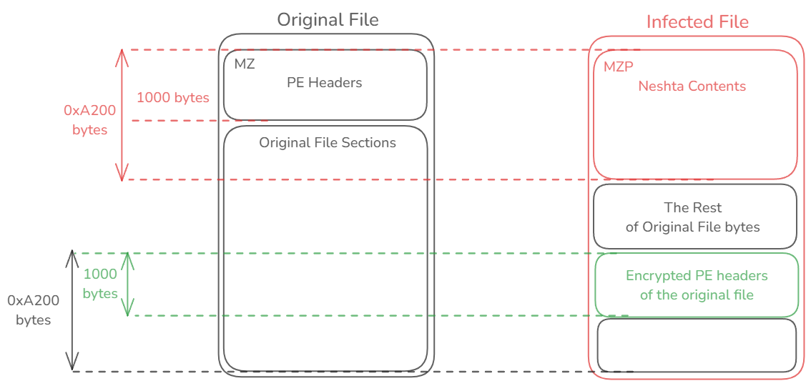

# Summary
Neshta is a Delphi malware which injects itself inside all executables inside the filesystem by:
* Overwriting `0xA200` bytes from the original file contents with its contents.
* Placing `0xA200` bytes of the original file contents at the bottom of infected file as follows:
    * Encrypting `0x3E8` bytes of the original file contents (PE Headers) using XOR operations.
    * Concatenating the remaining `0xA200` bytes as the original bytes.
* Once the executable is executed, Neshta rebuilds the executable by decrypting the PE header, overwriting the `0xA200` bytes of itself with the original bytes, and then writes the original executable to `%tmp%/3852-490` and the original executable is executed using `ShellExecuteA` API.




The decryption routine is very simple; it uses XOR to decrypt the PE Header byte by byte as follows:
* First, it retrieves a DWORD value as a seed, which is injected at offset `0x4d2` inside the `0xA200` bottom buffer.
* Then, it multiplies the seed by `0x8088405`, adds 1, multiplies the result by `0xff`, and finally shifts it right by 32 bits.
* This process is repeated until the `0x3E8` bytes are decrypted.

# Notes
* You should install the following packages
```
pip install yara-python psutil
```

* It's recommended to convert the script to exe using Pyinstaller
```
pip install pyinstaller
pyinstaller --onefile neshta.py
```

* Finally, you should run the script as administrator